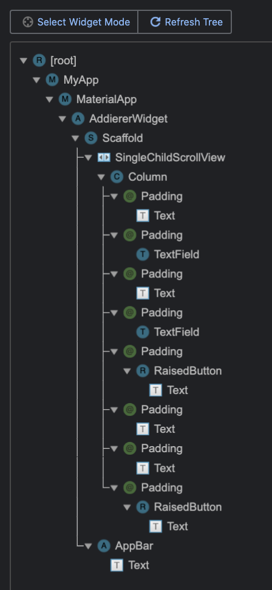

# Addierer zweier Zahlen / Adding two Numbers

## Getting Started

This is a very simple Flutter-App demonstrating the use of some basic Flutter-Widgets within a `StatefulWidget`.

The use of a `StatefulWidget`-object is necessary to display the results of adding two numbers.

Calling the inherited method `setState`-method of class `StatefulWidget` yields an immediate invocation of the corresponding `build`-method.

Figure 1. Homepage of *Adding two Numbers* App.

You should always have an imagination, how your Flutter app is made up of Flutter widgets. This architecture is also referred to as a *hierarchical tree of widgets*, see figure 2:

Figure 2. Hierarchical widgets tree.

***

## Erste Schritte

Die App dient zum ersten Einstieg in das Flutter-Framework. Die Anwendung einfacher Flutter-Widgets im Kontext eines `StatefulWidget`-Objekts stehen im Mittelpunkt.

Der Einsatz eines `StatefulWidget`-Objekts ist notwendig, um das Ergebnis der Addition zweiter natürlicher Zahlen zur Anzeige zu bringen.

Ein Aufruf der `setState`-Methode in der `StatefulWidget`-Klasse zieht unmittelbar einen Aufruf der `build`-Methode im Objekt nach sich.

Abbildung 1. Oberfläche der *Adding two Numbers*-App.

Bei Entwurf einer Flutter App sollte man immer eine Vorstellung haben, wie diese sich aus Flutter widgets zusammensetzt. Man spricht in diesem Zusammenhang
auch von einem *hierarchischen Widgetsbaum*, siehe Abbildung 2:

Abbildung 2. Hierarchischer Baum von Flutter Widgets.
