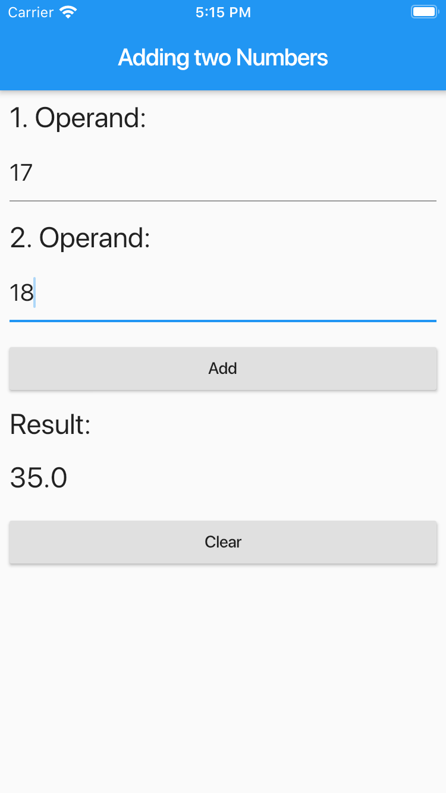

# Addierer zweier Zahlen / Adding two Numbers

## Getting Started

This is a very simple Flutter-App demonstrating the use of some basic Flutter-Widgets within a `StatefulWidget`.

The use of a `StatefulWidget`-object is necessary to show the results of adding two numbers.

Calling the inherited method `setState`-method of class `StatefulWidget` yields an immediate invocation of the corresponding `build`-method.

Abbildung 1. Homepage of *Adding two Numbers* App.

## Erste Schritte

***

Die App dient zum ersten Einstieg in das Flutter-Framework. Die Anwendung einfacher Flutter-Widgets im Kontext eines `StatefulWidget`-Objekts stehen im Mittelpunkt.

Der Einsatz eines `StatefulWidget`-Objekts ist notwendig, um das Ergebnis der Addition zweiter natürlicher Zahlen zur Anzeige zu bringen.

Ein Aufruf der `setState`-Methode in der `StatefulWidget`-Klasse zieht unmittelbar einen Aufruf der `build`-Methode im Objekt nach sich.

Abbildung 1. Oberfläche der *Adding two Numbers*-App.
